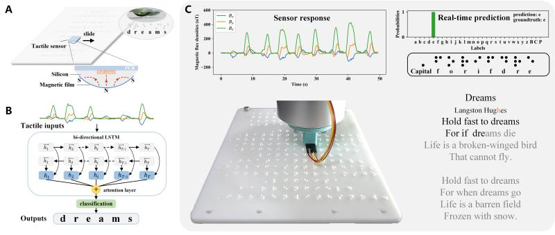

# braille


To demonstrate human-like Braille reading, we design our sensor as an arc-shaped tip (with
radius ~6mm) like the human fingerpad (with radius ~8mm), which is then installed at the
endpoint of a robot hand (above figure). When the sensor slides over the Braille characters with
different embossed patterns, the flexible magnet tip deforms accordingly, and the measured
magnetic flux densities (Bx, By, and Bz) along the x, y, and z directions also change in a
particular manner. Unlike the “reading by pressing” method that only involves the normal
force, the sequential tactile signals (Bx, By, and Bz) involve both normal and shear contact
information, which are fed into a neural network to predict the touched characters in a realtime
manner as what human does. In particular, the magnitude variations of Bx and By are
related to the position of the raised dots of each Braille character in the column and row
directions, respectively, and Bz is related to the overall pattern of the raised dots.


As illustrated in above figure, we design a bi-directional LSTM (Long Short Term Memory)
model with the attention mechanism for Braille prediction. The inputs of the LSTM network
are sequential tactile signals in terms of magnetic flux densities when sliding over each
Braille character, and the outputs of the network are the probabilities (or scores) of all class
labels for 26 English letters and three special symbols in the Braille alphabet. Then, the class
label that gets the highest score is chosen as the final prediction based on a majority voting.
Here, an attention layer is introduced to help the LSTM network learn how to focus on a
particular part of the tactile signals that can distinguish characters with similar readings (like
the letter “u” and “g,” or “l” and “s”). After training on around 900 instances of Braille
characters, the proposed model achieves a real-time recognition accuracy of 97% tested on
the Braille poem Dreams, which is comparable to proficient human
Science Robotics Manuscript Template Page 11 of 23
readers. Moreover, it is worth noting that such accuracy (97%) is the recognition of a single
character. If the semantic association strategy is employed, which is actually used by the
human, the recognition accuracy could be further improved.

##test trained model
```
python test.py

```


##train model
```
python train.py

```
